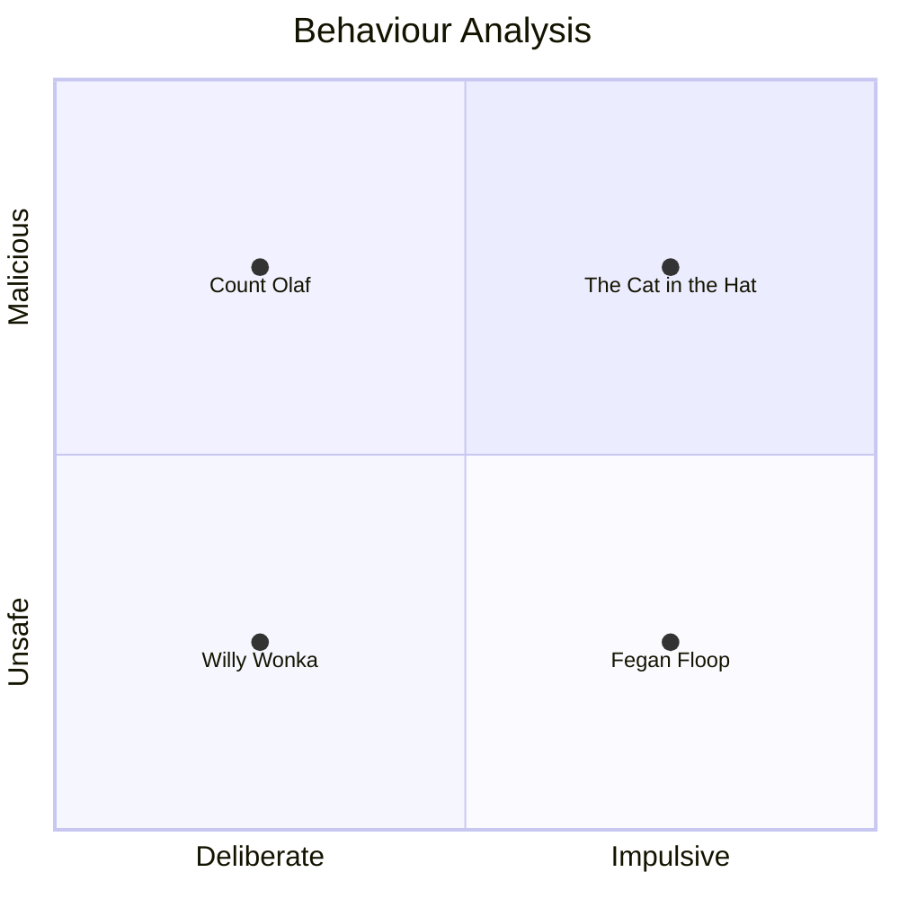

---
{"dg-publish":true,"permalink":"/notes/fae-like-entities-in-2000s-children-s-cinema/","created":"2026-09-10T16:45:42.480+01:00","updated":"2026-09-16T18:41:47.321+01:00","dg-note-properties":{"created":"2026-09-10T16:42","updated":"2026-09-16T18:58","noteStatus":"budding","aliases":null,"cssclasses":[]}}
---

Back to: [[Fae\|Fae]], [[Cinema\|Cinema]], 

# Fae-like entities in 2000s children's cinema

## Transcription of my notes from that time I was really fucking high

- Willy Wonka and Cat in the Hat are two sides of the same coin
    - Neutral evil
    - Wonka [[Autism Spectrum Disorder (ASD)\|autism]] vibes
    - [[Trauma\|Trauma]]. Parents word avoidance
    - Not immediately dangerous in a malicious way but very dangerous in a doesn’t give a shit apart from the system
- Cat in the Hat is just chaotic evil
    - Drag vibes
        - Very [[Camp\|camp]]
        - 2003 [[Racism\|racism]] go brrr
    - Actively malicious
        - Would literally murder for fun
        - Sleazy
        - Not safe to be around children
- Fegan Floop
    - Deeply strange but [[Camus\|Camus]]-adjacent
    - Literal child endangerment
    - Is he malicious? I can’t remember
    - Big thumbs
- Count Olaf
    - Aggressively malicious but in a rules lawyer way
    - Camp and theatrical
        - Androgynous
        - Crossdressing
    - Really murder-fae-like

## Musings on Fae-Like Entities in 2000s Children's Cinema

2000s children's cinema was fucking weird. I remember watching _Charlie and the Chocolate Factory_ (2005) on my dad's PSP on one of those tiny disc things Sony created that never took off and thinking this is _weird_. Weird in a way that makes me feel unsafe, almost. 

With many more fairytales, fantasy stories, and folklore under my belt, I have since realised that many of the characters in films I remember from the 2000s feel _fae_.

### What do I mean by fae?

The fae, especially the Celtic Fair Folk, typically have certain characteristics in stories. They are often gender non-conforming, androgynous, or otherwise unusual in their beauty; they have a propensity for rules, deals, and language play; they operate upon logic and ethics that may appear opaque and inappropriate to us; they are associated with a fantastical realm or plane where typical assumptions become incorrect or dangerous. This is by no means an exhaustive list, but all-in-all, the Folk are liminal – they occupy the space between boundaries, whichever boundaries those may be. 

### Willy Wonka
#### Charlie and the Chocolate Factory (2005)

Willy Wonka invites five children and a guardian for each into his factory because finding an heir normally wasn't theatrical enough. Though the children meet unfortunate ends, save Charlie, that isn't necessarily Wonka's intention. Each child is warned of the consequences of their transgression and proceeds regardless. Their resulting demise is, therefore, the predictable result of contact with an environmental hazard. 

### Count Olaf
#### A Series of Unfortunate Events (2004)

Count Olaf pursues the Baudelaire fortune, and by extension, the children and their guardians. The place in which the film is set is liminal, timeless, and locationless – suitably realm-like – and Count Olaf and his troupe continue the theme. They do not obey the typical rules of society. Olaf murders each guardian in such a way that their death becomes more than just a death. They perish dramatically. Their murders are stories. Remember the herpetologist who was envenomed by his own snake? The grammarian hermit consumed by leeches? They're fabulistic.

### The Cat in the Hat
#### The Cat in the Hat (2003)

Cat in the Hat is the definition of chaotic evil. He is actively malicious, he is sleazy, disgusting, and does not have your child's best interest at heart. He is governed purely by that which he finds amusing. He is capable of manipulating reality, revels in deception, and has an associated realm where the assumptions mortals hold are no longer applicable. I am still bewildered this was released as a children's film.

### Fegan Floop
#### Spy Kids (2001)

Fegan Floop is complex and therefore possibly the most fae. He isn't malicious, but neither is he safe. He shifts allegiances. He creates illusions in his virtual room. He transforms agents into Fooglies - bizarre creatures. He is androgynous and performative. He has an army of thumbs. Everything about him is dreamlike and impossible to anticipate through mortal eyes.

---

## Related to

- [[Changelings are neurodivergent\|Changelings are neurodivergent]]
- [[Fairytales are about the human condition\|Fairytales are about the human condition]]
- [[Liminality\|Liminality]]

## Ideas that stand in opposition

-

## Further reading

-

## References
