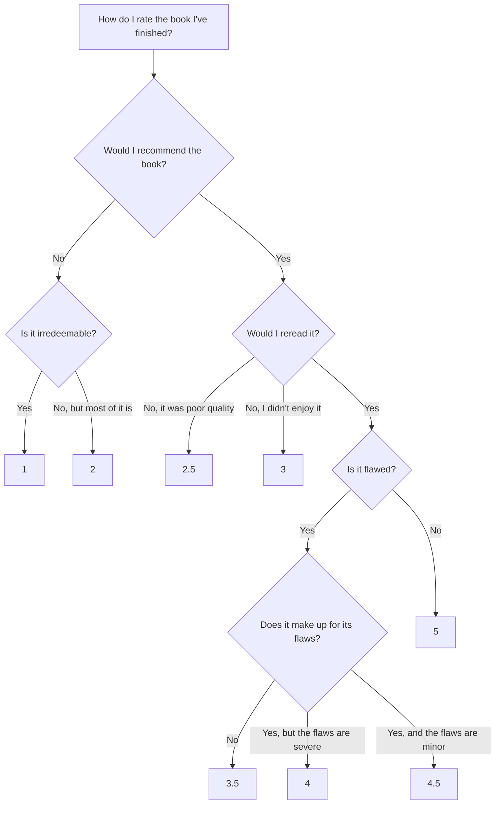

---
{"dg-publish":true,"permalink":"/notes/fiction-rating-flowchart/","created":"2026-07-25T13:22:59.417+01:00","updated":"2026-09-16T19:49:38.350+01:00","dg-note-properties":{"created":"2024-10-19-12:00","updated":"2026-07-16-21:47","cssclasses":[]}}
---

# Fiction Rating Flowchart

