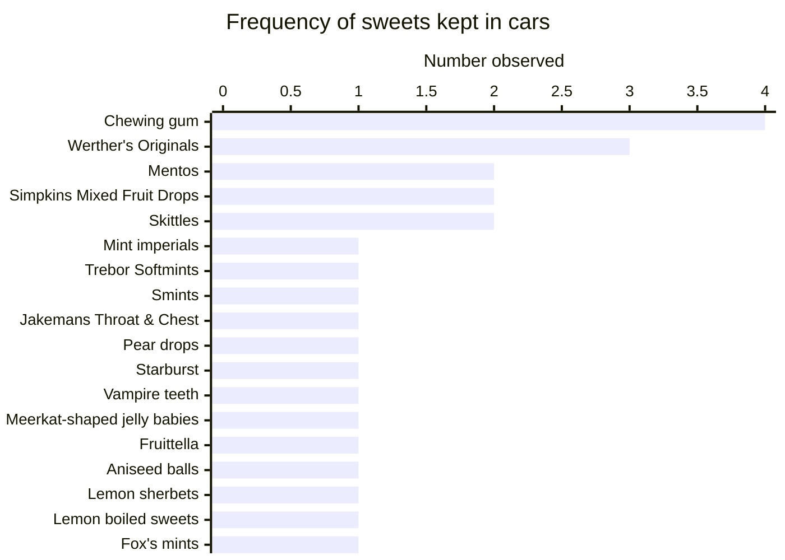
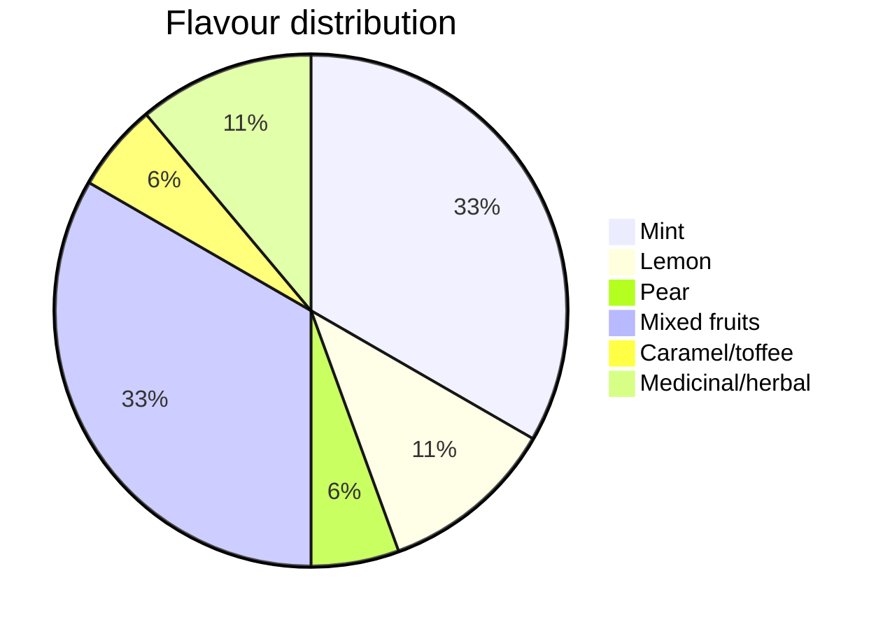

---
{"dg-publish":true,"permalink":"/notes/finding-the-perfect-car-sweetie/","title":"Finding the Perfect Car Sweetie","created":"2026-10-06T15:15:57.997+01:00","updated":"2026-10-07T14:28:36.120+01:00","dg-note-properties":{"created":"2024-09-14T22:48","updated":"2026-10-07T14:16","title":"Finding the Perfect Car Sweetie","noteStatus":"sprout","aliases":null,"cssclasses":[]}}
---

Back to: [[Driving\|Driving]], [[Cars\|Cars]], 

# Finding the Perfect Car Sweetie

I would like sweets in my car. Sometimes you just need a sweetie. It might be a pick-me-up, a blood sugar thing, whatever else a sweetie might be used for...

## Hypothesis

The ideal car sweetie is simultaneously enjoyable enough to want to eat, but not so enjoyable that you will eat multiple of them and thus consume the supply prematurely.

## Survey

The survey collected data on the number of people who used a particular sweetie as their car sweetie. This means that if someone keeps two sweetie types, both are represented in the chart.

Findings show a strong bias towards mints and mixed fruit flavours with chewing gum being the most frequently kept car sweetie. If we widen it to all fruit flavours, they do win out over mint. 

## The problem

The problem with mint is that I like mint too much. I will consume the mint sweeties. If I am to fulfill the criteria of a tier B sweetie, it cannot be minty. 

With fruit flavours being the other most common flavour (and chocolate obviously being a poor choice for a car), it follows that I should get a fruit sweet. But which?

## Finding the perfect fruit sweetie

Anything chewy is immediately out for me. They go gluey in the heat and cars warm up. Individually wrapped would also be ideal to prevent The Clump. So boiled it is. 

If I am looking for a tier B sweetie, I must immediately exclude anything above or below. This means that lemon (the quarter of lemon sherbets from Beamish was life changing), lime, and rhubarb are all immediately excluded. 

Possibilities are therefore pear drops, rosey apples, pineapple cubes, strawberry & creams, apple & custards, and fruit lollies. 

## The results

Forthcoming. Clearly the plan is to buy all of these and see which one I do not scoff. 

---

## Related to

- [[Lollipops are the best anti-binge sweetie\|Lollipops are the best anti-binge sweetie]]
- 

## Ideas that stand in opposition

-

## Further reading

-

## References
